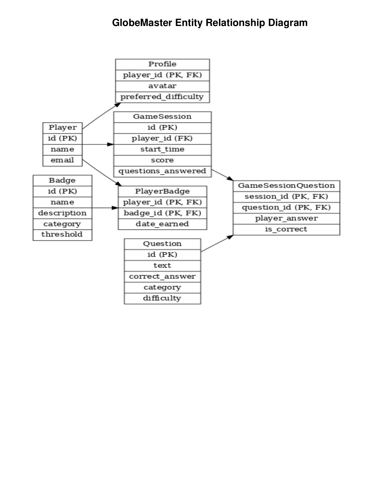

# 🌍 GlobeMaster

**GlobeMaster** is a full-stack geography quiz game built with **React**, **Flask**, and **PostgreSQL**.  
Players create a profile, play timed quiz sessions by category and difficulty, earn badges, and have their progress persisted across games.

This project was built as a **portfolio-grade, end-to-end Python application**, emphasizing clean backend logic, real database relationships, and a playable frontend experience.

---

## 🎯 Core Features

- 🎮 Play full quiz sessions end-to-end  
- 🧭 Category-based and difficulty-based questions  
- 🧠 Backend-validated answers and scoring  
- 🏅 Badge system (first launch, milestones, achievements)  
- 📊 Persistent game sessions and player history  
- 🔁 Resume-safe gameplay (server-side state)  
- 🧑‍💻 Clean API consumed by a React frontend  

---

## 🛠️ Tech Stack

| Layer | Technology |
|-----|-----------|
| Frontend | React + Vite |
| Backend | Python · Flask · SQLAlchemy |
| Database | PostgreSQL |
| Hosting | Heroku (monolithic deployment) |

> In production, the built React frontend is served directly by the Flask backend.

---

## 🎥 Demo Video

🎥 **Demo Video:** A short walkthrough of GlobeMaster’s gameplay flow, persistence, and leaderboards — https://youtu.be/jYXLE6toqDo

---

## 🧩 Architecture Overview

GlobeMaster is intentionally deployed as a **monolith**:

- One Flask application  
- One PostgreSQL database  
- One deployed service  

This approach matches the scope of the project and avoids unnecessary infrastructure complexity while remaining production-ready.

**Design principles:**
- Backend is the source of truth  
- No game logic is trusted to the client  
- Database models reflect real relationships  
- API is explicit, predictable, and testable  

---

## 🗂️ Data Model

Core entities include:

- **Player**
- **Profile**
- **GameSession**
- **Question**
- **GameSessionQuestion**
- **Badge**
- **PlayerBadge**



---

## 🚨 Required Seeding (Important)

⚠️ **GlobeMaster cannot be played without seeding the database first.**  
This is intentional and documented behavior.

Before running the application locally or after a fresh deployment, you **must** seed the following data:

### 1️⃣ Seed Questions
This populates the quiz question pool.

```bash
python backend/seed.py
```

### 2️⃣ Seed Badges
This populates the badge definitions used by the achievement system.

```bash
python backend/seed_badges.py
```

### Why this is required

- Questions are **not hardcoded**
- Badges are **not auto-generated**
- The game logic assumes both datasets already exist
- Without seeding, gameplay will fail or appear incomplete

This mirrors real production systems where reference data is loaded explicitly rather than inferred at runtime.

---

## 🚀 Deployment

GlobeMaster is deployed as a **single Heroku application**:

- Flask serves both the API and the frontend build  
- PostgreSQL is provided via Heroku Postgres  
- Environment variables handle configuration  

There is **no Docker requirement**.

---

## 🧪 Example API Endpoints

- `GET /meta/health` – Health check  
- `GET /meta/categories` – Quiz categories  
- `POST /players` – Create player  
- `GET /players/email/<email>` – Load player  
- `POST /games` – Start a new game session  
- `POST /game-session-questions` – Submit an answer  
- `GET /badges/player/<id>` – Player achievements  

---

## 📜 License

MIT License.
