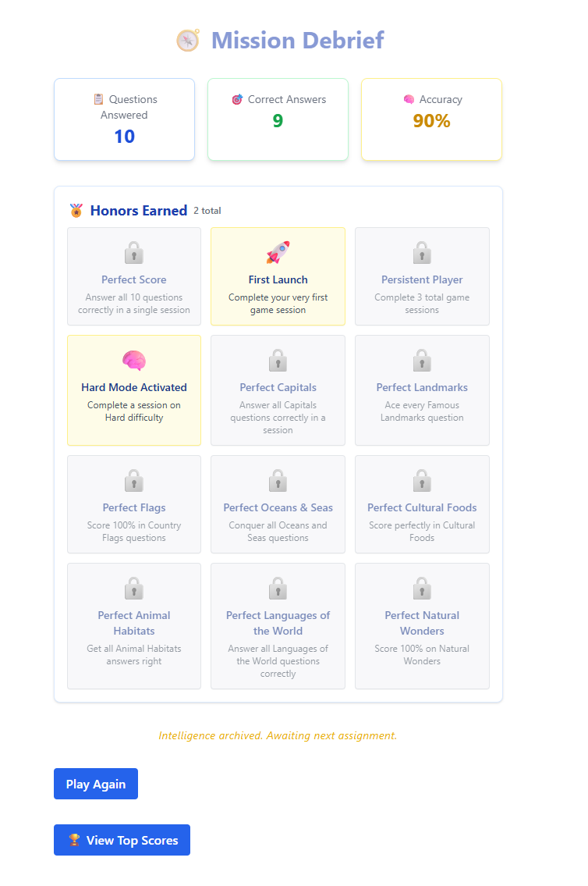
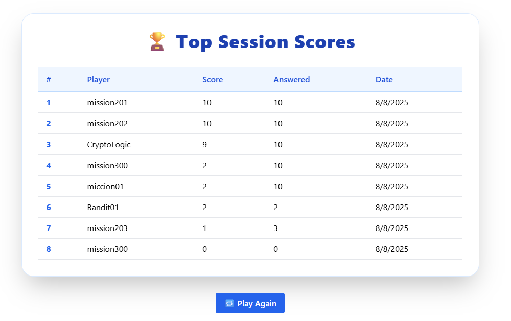
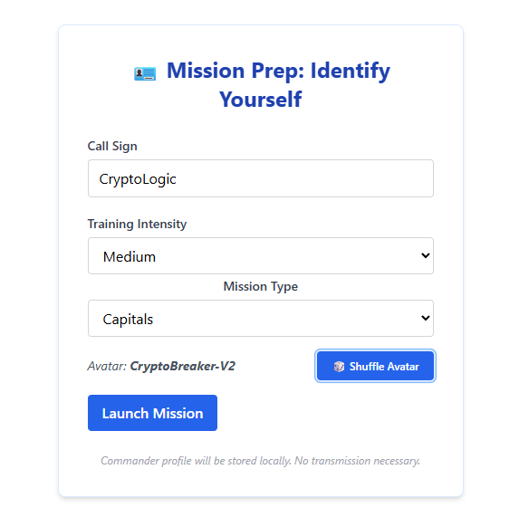

# 🌐 GlobeMaster

**GlobeMaster** is a full-stack geography quiz game built with React, Flask, PostgreSQL, and Docker. Players answer questions by category or preferred difficulty, earn badges, and track their performance across persistent game sessions.

---

## 🚀 Features

- ✅ 10-question quiz rounds
- ✅ Categories and difficulty-based question filtering
- ✅ Backend-driven scoring with persistent sessions
- ✅ Badges awarded for first launch, perfect scores, and category mastery
- ✅ Fully Dockerized setup for easy local development
- ✅ Responsive UI with dynamic feedback and profile info
- ✅ State persistence across reloads

---

## 🛠️ Tech Stack

| Layer     | Technology                         |
|-----------|-------------------------------------|
| Frontend  | React + Vite                       |
| Backend   | Flask + SQLAlchemy                 |
| Database  | PostgreSQL                         |
| Container | Docker + Docker Compose            |

---

## 🧩 Project Structure

```
globemaster/
├── backend/
│   ├── app/               # Flask app (routes, models, utils)
│   ├── seed.py            # Sample questions seeder
│   ├── Dockerfile         # Backend image
│   └── .env               # Database URL (ignored by Git)
├── frontend/
│   ├── src/               # React components
│   ├── Dockerfile.frontend
├── docker-compose.yml     # Project orchestrator
```

---

## ⚙️ Local Development

### 1. Clone the repo

```bash
git clone https://github.com/espinbrandon49/globemaster.git
cd globemaster
```

### 2. Add your `.env` file

Create `backend/.env`:

```
DATABASE_URL=postgresql://postgres:password@db:5432/globemaster
```

> ⚠️ This file is ignored via `.gitignore`

### 3. Start the stack

```bash
docker-compose up --build
```

- Frontend → [http://localhost:5173](http://localhost:5173)
- Backend API → [http://localhost:5000](http://localhost:5000)

---

## 🌍 Cloud Deployment

GlobeMaster is fully deployed on **AWS ECS Fargate** with a managed **RDS PostgreSQL** database and an **Application Load Balancer**:

- **Frontend**: React/Vite container, served via ECS/ALB  
- **Backend**: Flask API container, exposed via ALB  
- **Database**: PostgreSQL (Amazon RDS) for persistent sessions and badge data  
- **Architecture**: Two ECS services behind a shared ALB with target groups for port 80 (frontend) and port 5000 (backend)

**Demo mode:** The app is live on AWS for testing via the ALB DNS link:  http://alb-backend-1442970373.us-east-2.elb.amazonaws.com/

> ⚠️ This ALB DNS is for demo purposes only (HTTP, no HTTPS). Hosting will be discontinued once AWS credits expire.

## 🧪 Sample Endpoints

- `GET /games/<id>` – Retrieve game session info
- `POST /game_questions/` – Record player answer
- `PUT /games/<id>` – (Optional) Update session stats
- `GET /badges/player/<id>` – View earned badges

---

## 🧠 Design Notes

GlobeMaster emphasizes backend-first logic:
- Score and game progress are always stored server-side
- Frontend uses localStorage only for session handoff
- React auto-resumes progress after a page reload

---

<details>
<summary><strong>📸 Click to View Screenshots</strong></summary>
<br>

<h3>🎯 Question Screen</h3>

<p><em>Live gameplay screen showing the question prompt, selected category and difficulty, and an input field for the player’s answer.</em></p>

<h3>📊 End-of-Mission Summary</h3>

<p><em>End-of-mission debrief displaying questions answered, correct responses, and calculated accuracy.</em></p>

<h3>🏆 Top Session Scores Leaderboard</h3>

<p><em>Leaderboard view ranking players by session performance, highlighting competitive scoring and replay value.</em></p>

<h3>🪪 Commander Profile Creation</h3>

<p><em>Create-player screen where users input their call sign, choose a training intensity (difficulty), and assign a random avatar codename.</em></p>

<h3>📐 Entity Relationship Diagram (ERD)</h3>
<a href="docs/globemaster_erd.pdf">📄 View ERD PDF</a>
<p><em>Visual map of all core database entities and their relationships, designed in draw.io and used for backend schema planning.</em></p>

</details>

## 🎥 Demo Video

[](https://youtu.be/WIwkGwSnizs)  
*A complete walkthrough of GlobeMaster gameplay: from profile setup to leaderboard in just 1:34.*

---

## 📜 License

MIT License. Built with 🚀, 🧠, and a slight obsession with global trivia.
